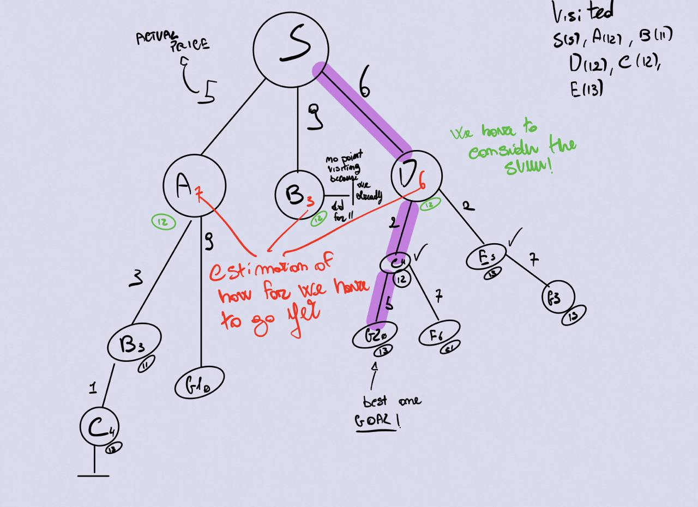

Author: Francesco Di Gangi
# Understanding the problem: Set Covering
Given a set of elements {1, 2, …, n} (called the universe) and a collection S of m sets whose union equals the universe, the set cover problem is to identify the smallest sub-collection of S whose union equals the universe. For example, consider the universe U = {1, 2, 3, 4, 5} and the collection of sets S = { {1, 2, 3}, {2, 4}, {3, 4}, {4, 5} }. Clearly the union of S is U. However, we can cover all of the elements with the following, smaller number of sets: { {1, 2, 3}, {4, 5} }. **(wikipedia.org)**

I was able to see that some solutions on the web use a greedy algorithm, and the professor gave us a solution using a greedy algorithm. 

Some examples:

- U = {1,2,3,4,5}
- S = {S1,S2,S3}
- S1 = {4,1,3},    Cost(S1) = 5
- S2 = {2,5},      Cost(S2) = 10
- S3 = {1,4,3,2},  Cost(S3) = 3

**Output**: Minimum cost of set cover is 13 and set cover is {S2, S3}

There are two possible set covers *{S1, S2} with cost 15* and *{S2, S3} with cost 13.*

# Professor's solution
<pre><code>import logging
logging.getLogger().setLevel(logging.DEBUG)

def greedy(N):
    goal=set(range(N))
    covered=set()
    solution=list()
    all_lists=sorted(problem(N,seed=42),key=lambda 1:len(1))
    while goal != covered:
        x=all_lists.pop(0)
        if not set(x) < covered: #sottoinsieme stretto
            solution.append(x)
            covered |= set(x) #unione fra i due set e prende gli elementi distinti
    print(f"Greedy solution: {solution}")
</code></pre>

# First solution proposed: greedy search

It tries to explore the node that is closest to the goal. If we have more than one node close to the initial state, we search for the one where the cost is the lowest.

<pre><code>def set_covering_problem_greedy(universe,subsets,costs):
    cost=0
    visited=0
    #create a unique set - source: documentation
    elements=set(e for s in subsets for e in s) 
    if elements!=universe:
        return None
    covered=set()
    solution=[]
    while covered!=elements:
        subset = max(subsets,key=lambda s: len(s-covered)/costs[subsets.index(s)])
        solution.append(subset)
        cost+=costs[subsets.index(subset)]
        visited=visited+1
        covered |= subset
    print("NUMBER OF VISITED NODES: ",visited)
    return solution,cost 
</code></pre>

## Explanation

I start initializing a variable cost at zero (I need to sum then all the costs - that will be one), then I take all the elements in subsets one time. I make sure that there is the universe in the elements, otherwise I return `None`.
Then I create two variables, covered and solution. Covered will be used to add all the subset with |= (between sets it means union operation). 
Every time of each set I take the one with the highest "not covered" element / the cost ratio (probably I can avoid since all costs are 1).

**Sources**: professor's solution, GitHub, StackOverflow, my notes (theory about greedy search)

# Second solution proposed: breadth first search

In this search algorithm we start from the tree root and explore all nodes at the present depth, with the prior to move on the nodes that have another next depth level. A tree search don’t remember visited nodes and is exponentially slower, but it is memory efficient. A graph search instead is faster, but memory-blow up. 
<pre><code>def set_covering_problem_bf(universe,subsets,costs):
    cost=0
    elements=set(e for s in subsets for e in s)
    if elements!=universe:
        print("The subsets don't contain the universe.")
        return None
    covered=set()
    solution=[]
    queue=[]
    visited=[]
    while covered!=elements:
        subset = max(subsets,key=lambda s: len(s-covered))
        #print(subset, " subset")
        queue.append(subset)
        x=queue.pop()
        if x not in visited:
            visited.append(subset)
            solution.append(subset)
            cost+=costs[subsets.index(subset)]
            covered |= subset
    print("NUMBER OF VISITED NODES: ",len(visited))
    print("w: ",sum(len(_) for _ in solution))
    return solution,cost
</code></pre>

## Explanation
I used the pseudo code of the Breadth First, but applying it to the variables I have.
<pre><code>function (G,V):
	create queue Q
	insert V (radix) in Q
	sign V
	while q is not empty:
		t <- Q.pop()
		if t is what i am looking for:
			return t
		for all nodes in G.unlivellosotto(t) do
			u <- G.nonadicenti(t,e)
			if u is not signed
					sign u
					insert u in Q
	return none
</code></pre>

# Future implementation: A Star 

The basic idea is to run the best-first but adding a component, so I am not only taking in account my cost but also my estimated cost. Here at some point the cost become larger, so if I am using A* I start going down. It can be proven but it is complete and optimally efficient (always able to compute the better path expanding a minimum number of nodes). Is a best first.

## Explanation

Basically, with the actual price I have to consider an estimated price (which I estimate with a heuristic that has to be optimistic) which is the estimation of how far I have to go yet to reach a **goal state***

**Sources**: John Levine - A Star Searching, my notes.
